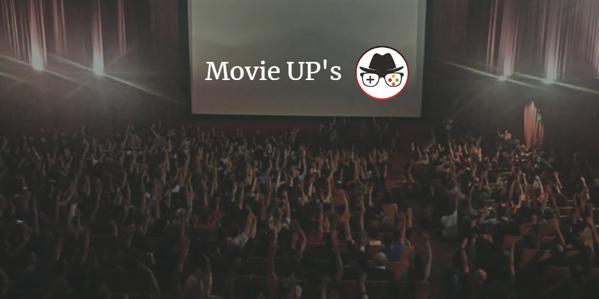

Movie UP'S
=================

Es una web app creada para los cinéfilos que quieren compartir aquellos errores de la industria cinematográfica que muchos no ven, y al mismo tiempo formar parte de una comunidad donde compartir toda la información que durante años cuesta obtener del séptimo arte.

**Nuestra Idea**

Te ha pasado que derrepente estás viendo tu película favorita y de pronto te percatas de un error imperdonable que seguramente nadie más notó. Aquella donde Jake en "Avatar" al abrir la cápsula no tiene la silla de ruedas y 1 segundo después aparece de la nada.
Los grandes amantes de las películas suelen tener una enorme habilidad para conseguir descubrir los errores y distintos fallos que ven en las películas. Cada pequeño cambio en la apariencia de los personajes, o la posición de los objetos suele ser lo primero en lo que se fijan todos esos observadores cada vez que sale una nueva película en el cine.

**Prototipo y Usabilidad**

[Presentación](https://docs.google.com/presentation/d/1XaR5Gcv30Vlw_dLteomJvhOoMmvgzK_l4ywXXdy0SNg/edit#slide=id.p)